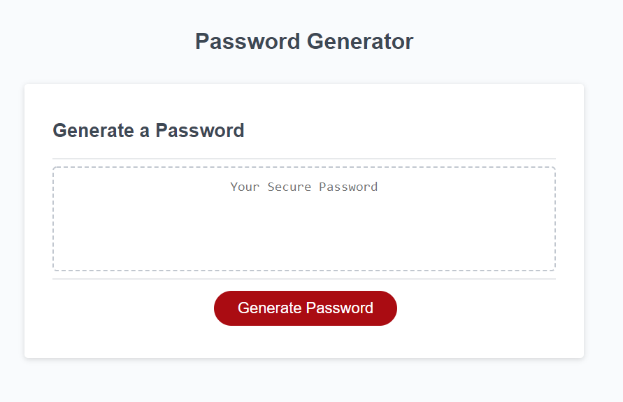
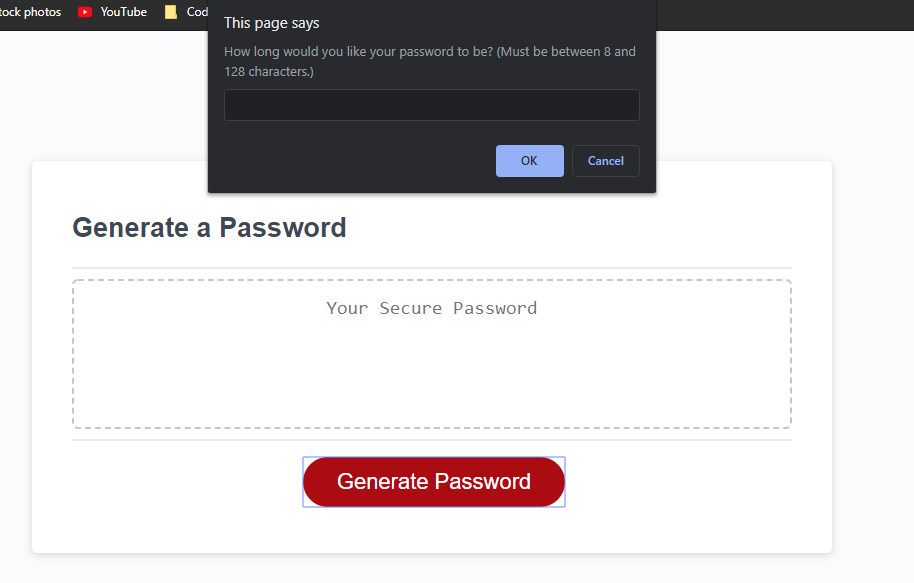
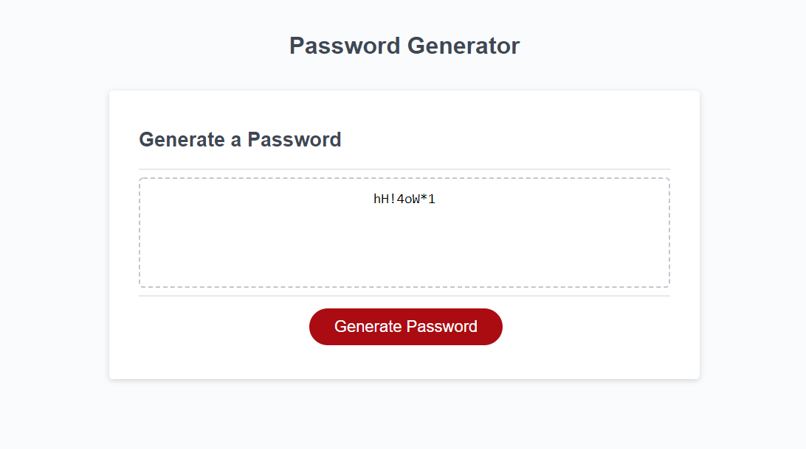

# Password Generator
Password Generator creates a password through the use of prompts, arrays & objects. This generator takes the user input and generates a password based off the criteria given by user. User input is validated at the beginning and returns to inital page if minimum password length is to small or is over the maximum length. 

## Deployment
Live page at: [https://beki-g.github.io/Password_Generator/](https://beki-g.github.io/Password_Generator/)

> Screenshot of initial landing page 

> Screenshot of user input through the use of prompts 

> Screenshot of final password after it has been generated 

## Built with 
* Javascript

## Author
Myself, [Beki](https://github.com/Beki-G)